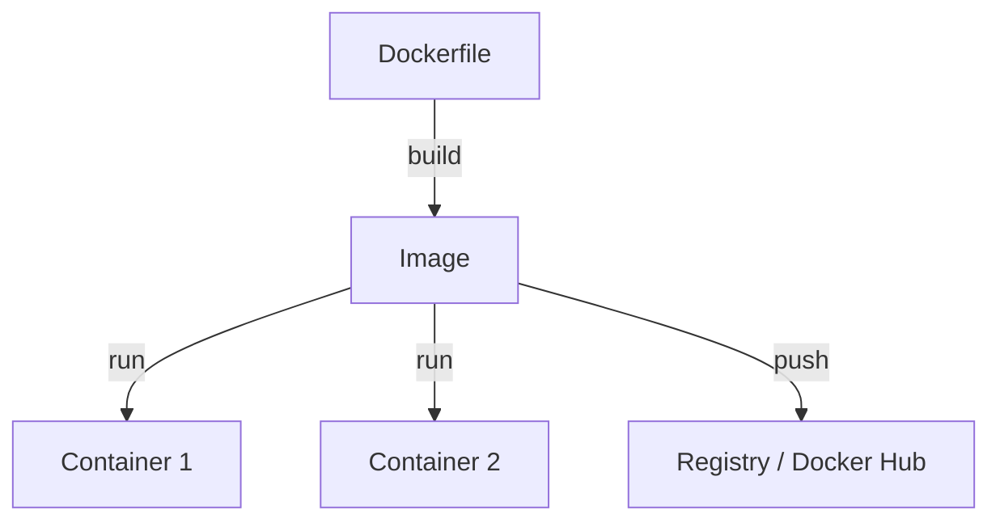

# Docker (도커)

> "내 컴에선 되는데?"라는 말을 영구히 박멸한 혁명

애플리케이션을 실행하는 데 필요한 모든 것(코드, 런타임, 라이브러리, 설정 등)을 하나로 묶어 **컨테이너(Container)**라는 단위로 관리하는 플랫폼이다. 2013년에 등장하여 인프라 세상을 완전히 바꿔놓았다.

## 왜 필요한가? (유치원 비유)

예전엔 서버를 옮길 때마다 이사하는 것처럼 짐을 싸고 풀고 설정하느라 난리였다(가상 머신, VM). 하지만 도커는 **컨테이너 박스**와 같다.

- **기존(VM)**: 집 한 채를 통째로 빌려주는 것. 무겁고 느리다.
- **도커(Container)**: 방만 하나 빌려주는데, 물, 전기(커널)는 건물 전체와 공유한다. 가볍고 빠르다.

어떤 환경(Windows, Mac, Linux)이든 도커만 깔려있으면 내 앱은 똑같이 돌아간다.

## 핵심 개념 3대장

1.  **Dockerfile**: 앱을 만드는 레시피. "Python 설치하고, 코드 복사하고, 8000번 포트 열어줘."
2.  **Image**: 구워진 빵. 레시피(Dockerfile)대로 만들어진 실행 가능한 파일 뭉치. (붕어빵 틀)
3.  **Container**: 먹을 수 있는 빵. 이미지(틀)를 실행해서 실제로 돌아가고 있는 상태. (붕어빵)

## 장점

-   **일관성**: 개발자 컴퓨터에서 잘 되면 서버에서도 잘 된다.
-   **속도**: 가동 속도가 초 단위다.
-   **효율**: 가상 머신(VM)보다 가볍고 자원을 적게 먹는다.

## 생태계

-   **Docker Hub**: 전 세계 사람들이 만들어둔 이미지를 공유하는 시장. [[MySQL]], [[Redis]] 같은 거 그냥 갖다 쓰면 된다.
-   **Docker Compose**: 여러 개의 컨테이너(DB + 서버 + 프론트)를 한 번에 실행하게 돕는 도구.
-   **[[Kubernetes]]**: 수백 대의 도커 컨테이너를 관리해주는 대장.

## 기타

1.  **고래 로고**: 도커 로고 속 고래 이름은 **모비(Moby)**다. 컨테이너를 등에 지고 전 세계를 누빈다.
2.  **도트 파일**: 도커는 리눅스의 '네임스페이스'와 'Cgroup'이라는 기능을 영리하게 엮어 만든 것이다. 마법 같은 기술이라기보다 기존 기법의 혁신적인 조합이다.
3.  **한계**: 도커는 가상화가 아니라 **격리**다. 따라서 윈도우용 도커를 리눅스에서 돌리는 건 (지금은 기술이 좋아졌지만) 원래 불가능한 게 정상이다.
