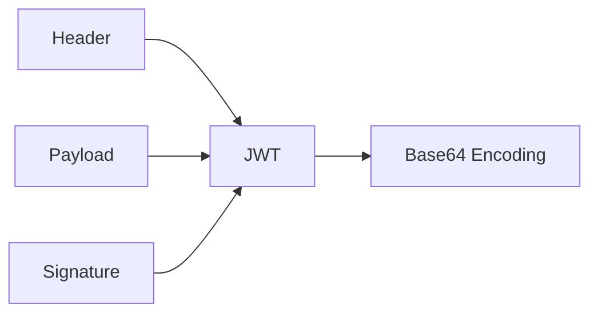

# JWT (JSON Web Token)

> "내 정보를 증명하는 위조 불가능한 신분증"

웹 표준([[Standard]])으로서 정의된 데이터 전송 방식. 두 상대방 사이에 JSON 메모리를 안전하게 전송하기 위한 방법이다. 주로 **[[인공지능]] 인증(Authentication)**과 **인가(Authorization)**에 쓰인다.

## 왜 필요한가? (세션 vs 토큰)

- **전통적 방식(Session)**: 서버가 "누가 로그인했는지" 메모리에 적어둔다. 사용자가 많아지면 서버 메모리가 터지고, 서버가 여러 대면 공유하기 힘들다.
- **JWT 방식(Token)**: 서버는 기억하지 않는다. 대신 사용자에게 **"너는 홍길동이고 1시까지 유효해"**라고 적힌 싸인 된 종이(JWT)를 준다. 사용자가 이 종이를 들고 오면 서버는 싸인만 확인하고 통과시킨다. (State-less)

## 구조: 세 토막의 비밀

JWT는 점(`.`)으로 구분된 세 부분으로 되어 있다.

1. **Header (헤더)**: "이건 JWT고, [[암호화]] 알고리즘은 HS256이야."
2. **Payload (내용)**: "이 사람 ID는 123이고, 이름은 홍길동이야." (여기에 민감한 비밀번호는 넣지 마라! 누구나 볼 수 있다)
3. **Signature (서명)**: "위의 내용이 내가 쓴 게 맞는지 확인하는 비밀 도장." (서버만 아는 비밀키로 만든다)

## 장점 vs 단점

### 장점
- **가볍다**: 서버 메모리를 안 쓴다. (Stateless)
- **확장성**: 서버가 100대여도 비밀키만 같으면 어디서든 인증 가능하다.
- **모바일 친화적**: 쿠키를 관리하기 어려운 앱 환경에서 쓰기 좋다.

### 단점
- **취소 불가**: 한 번 발행된 토큰은 유효기간 전까지 강제로 뺏을 수 없다. (그래서 수명을 짧게 하고 [[OAuth 2.0]]의 Refresh Token을 쓴다)
- **데이터 크기**: Payload에 정보를 너무 많이 넣으면 네트워크 전송량이 늘어난다.

## 기타

1. **JWT는 암호화가 아니다**: JWT는 정보를 숨기는 게 아니라 **"변조되지 않았음"**을 증명하는 것이다. 누구든 Base64 디코딩만 하면 내용을 볼 수 있으니 비밀을 담지 마라.
2. **디버깅 성지**: [jwt.io](https://jwt.io) 사이트에 가면 내 토큰에 뭐가 들었는지 바로 확인할 수 있다. 개발자의 필수 북마크다.
3. **이름 읽는 법**: '제이-더블유-티'라고 읽거나 영미권에선 'jot(조트)'라고 읽기도 한다.
