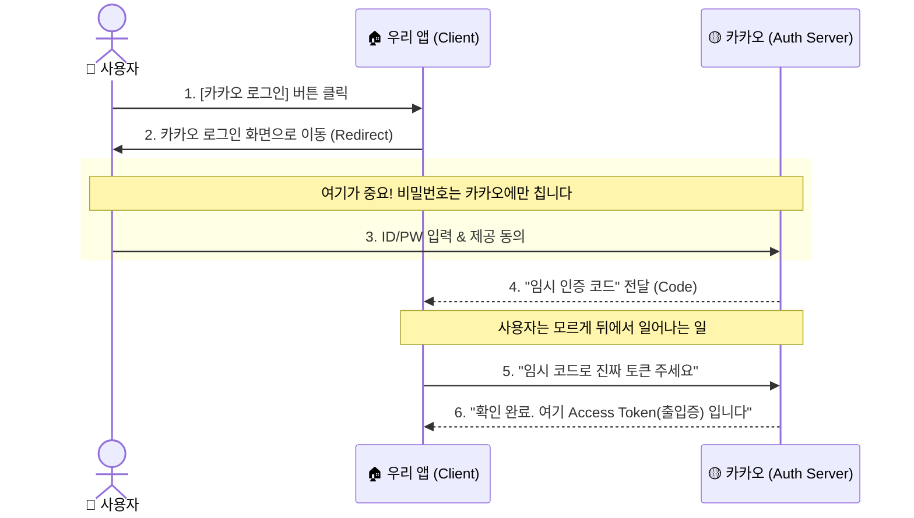

# OAuth 2.0

> "믿을 수 있는 곳에서 발급해준 '출입증'만 보여주세요"

사용자가 자신의 비밀번호를 앱에 넘겨주지 않고, **구글이나 카카오 같은 공신력 있는 플랫폼(Authorization Server)**의 인증을 빌려 서비스 이용 권한을 부여하는 기술이다.

## 핵심 개념: 안전한 '임시 출입증'

우리가 회사나 행사장에 들어갈 때, 내 모든 개인정보를 경비원에게 주지 않는다. 대신 믿을 수 있는 기관이 발급해준 **출입증(Pass/Token)**만 목에 걸고 보여주면 통과된다.

OAuth도 똑같다.
1.  **사용자**: 앱에게 "내 구글 비밀번호"를 주는 건 너무 위험하다.
2.  **앱(App)**: "그럼 비밀번호는 주지 마시고, 구글이 '이 사람 맞다'고 보증해준 **출입증(Token)**만 받아오세요."
3.  **구글(Google)**: "사용자 본인 확인했습니다. 여기 이 앱이 사용할 수 있는 **임시 출입증(Access Token)** 발급해 드릴게요."

결과적으로 앱은 사용자의 비밀번호를 절대 알 수 없지만, 사용자의 정보(이메일, 프로필 등)는 안전하게 이용할 수 있게 된다.

## 왜 쓰는가?
-   **보안**: 쇼핑몰 앱 하나 털렸다고 내 구글 계정까지 털리면 안 되니까.
-   **편의성**: "회원가입 -> 비밀번호 설정 -> 이메일 인증" 과정을 "카카오로 3초 만에 시작하기"로 줄여준다.

## 핵심 흐름 (소셜 로그인 과정)

글로 보면 어렵지만, 그림으로 보면 "왔다 갔다" 하는 게 전부입니다.

### 단계별 쉬운 설명

1.  **"로그인 할래요"**: 사용자가 앱에서 [카카오 로그인] 버튼을 누릅니다.
2.  **"카카오로 가세요"**: 앱은 사용자를 **카카오의 로그인 화면**으로 보냅니다. (비밀번호를 앱이 직접 받으면 안 되니까요!)
3.  **"진짜 너 맞니?"**: 사용자가 카카오 화면에서 로그인을 완료합니다.
4.  **임시표 발급 (Code)**: 카카오는 앱에게 **임시 인증 코드**를 하나 줍니다. "얘 인증됐으니까, 이걸로 토큰 바꿔가라고 해."
5.  **토큰 교환 (Token)**: 앱은 이 임시 코드를 들고 카카오 서버(뒷문)로 가서 말합니다. "아까 그 임시표 가져왔어요. 진짜 열쇠(Token) 주세요."
6.  **완료**: 카카오는 **Access Token(출입증)**을 발급해줍니다. 이제 앱은 이 출입증으로 사용자 정보를 조회할 수 있습니다.

## 용어 정리 (어려워 보이지만 별거 아님)

OAuth에는 총 4가지 핵심 인물이 등장한다. 누가 누구인지 확실히 알면 로직이 보인다.

1.  **Resource Owner (나, 사용자)**
    -   **설명**: 내 정보를 가지고 있는 **진짜 주인**이다. 
    -   **역할**: "이 앱이 내 이메일을 봐도 될까?" 라고 물어볼 때 [동의] 버튼을 눌러주는 결정권자다.

2.  **Client (우리 앱)**
    -   **설명**: 구글/카카오에게 정보를 빌려 쓰고 싶어 하는 **서비스 주체**다. 
    -   **역할**: 사용자에게 "로그인해 주세요"라고 부탁하고, 서버에서 토큰을 받아다가 잘 보관하는 관리자다. (손님인 사용자를 모시는 입장이니 Client라 부른다)

3.  **Authorization Server (인증 서버)**
    -   **설명**: 구글/카카오의 **로그인 담당 부서**다.
    -   **역할**: ID/PW가 맞는지 확인하고, 맞다면 "너 진짜 맞구나!" 하며 도장을 찍어주는 출입국 관리소 같은 곳이다.

4.  **Resource Server (자원 서버)**
    -   **설명**: 구글/카카오의 **데이터 보관 창고**다. (사용자의 닉네임, 이메일, 친구 목록 등이 담겨있다)
    -   **역할**: 앱이 나중에 출입증(Access Token)을 들고 찾아오면, 출입증이 진짜인지 검사한 뒤 데이터를 꺼내주는 창고지기다.

### 🎫 토큰 형제들

-   **Access Token (출입증)**: 
    -   **특징**: 가장 중요하다. 앱이 정보를 달라고 할 때마다 매번 이걸 보여줘야 한다. 
    -   **현실**: 보안을 위해 수명이 짧다(보통 1시간). 잃어버려도 금방 무효화되어 안전하다.
-   **Refresh Token (재발급 쿠폰)**: 
    -   **특징**: 사용자가 매번 로그인하기 귀찮으니까 주는 보너스다. 
    -   **현실**: Access Token이 만료되면 앱이 이 쿠폰을 서버에 제출한다. 그럼 서버가 "오, 정당한 쿠폰이군" 하며 새 출입증을 발급해준다. 사용자를 다시 귀찮게 하지 않아도 된다.
-   **Scope (권한 범위)**: 
    -   **특징**: 출입증에 적힌 **"갈 수 있는 방 리스트"**다. 
    -   **현실**: "내 이메일만 읽기 허용", "내 캘린더 쓰기 허용" 처럼 딱 필요한 권한만 쪼개서 부여할 수 있다.

## 현실적인 고민: 어떤 것을, 몇 개나 넣을까?

막상 구현하려 하면 "구글만 넣을까? 카카오, 네이버, 페이스북 다 넣을까?" 고민이 시작된다.

### 1. 어떤 소셜 로그인을 가장 많이 쓰나?
-   **대한민국**: **카카오**가 압도적 1위다. 스마트폰에 다 깔려있어 3초 컷이 가능하다. 그 다음이 네이버, 구글 순이다.
-   **글로벌/IT**: **구글**과 **GitHub**이 기본이다.
-   **iPhone 유저**: 애플 정책상 다른 소셜 로그인을 넣는다면 **Apple로 로그인**을 무조건 강제로 넣어야 승인이 난다.

### 2. 하나만 할까? 여러 개 할까?
-   **하나만 하는 경우 (Single Provider)**:
    -   장점: 데이터 관리가 매우 깨끗하다. "이 이메일이 저 이메일인가?" 고민할 원천 차단.
    -   단점: 해당 플랫폼 안 쓰는 사람은 가입을 포기한다.
-   **여러 개 하는 경우 (Multi Provider)**:
    -   장점: 사용자 접근성이 좋아진다.
    -   단점: **계정 통합 문제**가 발생한다. 어제는 카카오로 가입하고 오늘은 네이버로 로그인하면, 같은 사람인데 계정이 두 개 생기는 불상사가 일어난다. (이메일 비교 로직이 필수!)

### 3. 주요 소셜 로그인 플랫폼별 특징

| 플랫폼 | 주요 특징 (장점) | 고려해야 할 점 (단점) |
| :--- | :--- | :--- |
| **🟡 카카오** | **국내 점유율 독보적 1위.** 스마트폰에 앱이 이미 깔려 있어 비밀번호 입력 없는 3초 가입이 가능함. 카카오톡 채널 연동 등 비즈니스 확장이 쉬움. | 국내 유저로 한정됨. 비즈니스 채널 설정을 잘못하면 유저에게 광고 톡이 가서 거부감을 줄 수 있음. |
| **🟢 네이버** | **신뢰의 상징.** 쇼핑이나 검색 유저가 많아 3040 이상의 연령층에게 가장 익숙함. 네이버 페이 등과 연동할 때 유리함. | 개발자 센터 설정이 타사 대비 다소 까다로움. '카페'나 '블로그' 활동 명칭과 섞여 유저가 익숙한 이름을 선택하기 어려울 때가 있음. |
| **🔴 구글** | **글로벌 스탠다드.** 안드로이드폰/크롬 브라우저 사용자에게 공기와 같은 접근성 제공. 전 세계 어디서나 통하는 신뢰도. | 한국에서는 카카오/네이버에 비해 '로그인 시도' 자체가 적을 수 있음. |
| **⚪ 애플** | **보안과 프라이버시.** '나의 이메일 가리기' 기능 등으로 개인정보 보호에 민감한 유저가 선호. iOS 앱 출시 시 다른 소셜 로그인을 쓴다면 무조건 강제로 넣어야 함. | 유저가 이메일을 숨기면 실제 이메일을 알 수 없어 고객 관리가 어려움. 애플 개발자 계정(유료)이 필수임. |

## 기타

OAuth 2.0은 기술적인 내용 뒤에 흥미로운 뒷이야기도 많다.

### 1. 설계자가 자기 이름을 빼달라고 한 사연
OAuth 2.0의 핵심 설계자였던 **에란 해머(Eran Hammer)**는 표준 완성 직전에 "이 표준은 지옥으로 가는 길이다"라며 자신의 이름을 명세서에서 빼달라고 요청하고 프로젝트를 떠났다. 대기업들의 입맛에 맞추느라 표준이 너무 복잡해지고 보안상 허점이 생겼다는 이유였다. 그래서 개발자들이 지금도 OAuth를 구현하며 고통받는 것일지도 모른다.

### 2. 버전 1.0과는 남남이다
보통 소프트웨어는 버전 1에서 2로 가면 하위 호환성이 유지되지만, OAuth 2.0은 1.0과 **완전히 다르다.** 1.0이 너무 어려워서 새로 판 것이 2.0인데, 아이러니하게도 2.0도 옵션이 너무 많아져서 구현하기 까다로운 건 매한가지다.

### 3. 인증(Authentication)이 아니다?
원래 OAuth는 **권한 부여(Authorization)**를 위한 도구다. 즉, "내가 누구인지 증명"하는 게 아니라 "내가 저 창고에 들어갈 수 있는 권한이 있음"을 증명하는 것이다. 하지만 전 세계적으로 소셜 로그인(인증) 용도로 너무 많이 쓰이다 보니, 아예 인증 기능을 제대로 얹은 **OIDC (OpenID Connect)**라는 표준이 나중에 따로 나왔다.

### 4. 벨렛 키(Valet Key)의 원조
앞서 말한 '발렛 파킹 키' 비유는 OAuth 표준 문서나 강연에서 거의 공식적으로 쓰이는 비유다. 기술을 설명할 때 비유 하나가 얼마나 큰 힘을 발휘하는지 보여주는 아주 좋은 사례다.

## 요약
OAuth는 결국 **"남의 인증 시스템을 빌려와서 안전하고 빠르게 우리 유저로 만드는 기술"**이다. 복잡한 흐름과 역사적 드라마(?)에 매몰되기보다, "어떻게 하면 유저가 더 편하게 들어올까?"를 먼저 고민해보자.

