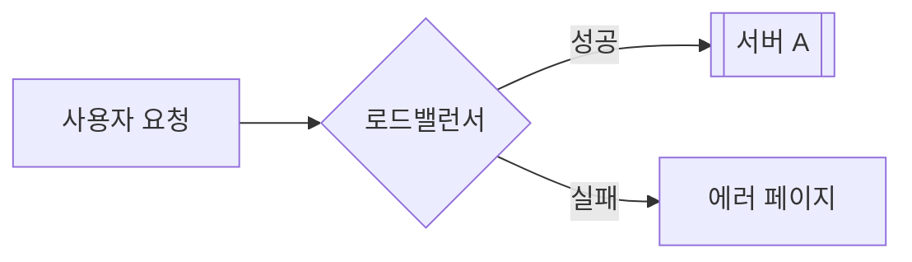

# 문서 제목

> 이 문서의 핵심 내용을 한 줄로 요약하는 위트 있는 문구

여기는 해당 개념에 대한 정의와 개요를 작성하는 공간입니다. 중요한 키워드나 다른 문서로 연결되는 단어는 **[[위키 링크]]** 처럼 대괄호 두 개를 사용하여 감싸줍니다.

- **기본 링크**: `[[JavaScript]]` (문서 제목 그대로 표시)
- **별칭 링크**: `[[예시|example]]` (링크는 '예시' 문서로 연결되지만, 화면에는 'example'로 표시)

## 1. 섹션 구분 (Level 2)

내용을 구분할 때는 `##`를 사용합니다.

- **강조**: 중요한 용어는 볼드체로 표시합니다.
- **리스트**: 불렛 포인트를 사용해 가독성을 높입니다.
- **인라인 코드**: `Command`나 `Variable`은 백틱으로 감싸줍니다.

### 1.1 하위 섹션 (Level 3)

더 자세한 분류가 필요할 때 사용합니다.

## 2. 시각화 (Mermaid)

복잡한 개념은 [[Mermaid]] 다이어그램을 활용해 표현하면 좋습니다.



## 3. 코드 예시

구체적인 사용법이나 설정 파일의 예시를 적어줍니다.

```javascript
// 예시 코드
const greeting = "Hello, YumiWiki!";
console.log(greeting);
```

## 4. 활용 및 도구

- **[[관련_기술_1]]**: 간단한 설명
- **[[관련_기술_2]]**: 간단한 설명

## 기타

관련된 철학이나 추가로 읽어볼 만한 주제를 적으며 마무리합니다. "하루에 몇 번 배포할 수 있는가?" 같은 질문을 던지는 것도 좋습니다.
