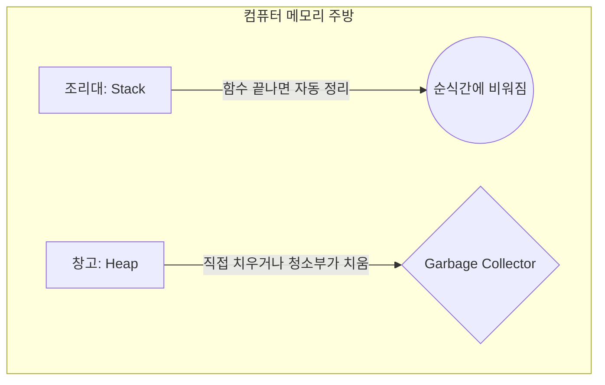

# 메모리 (Memory)

> "CPU라는 요리사가 요리를 할 때 쓰는 '조리대'이자 '식재료 창고'"

컴퓨터에서 데이터가 일시적으로 저장되는 공간(RAM)이다. 프로그래밍을 한다는 것은 결국 **"메모리에 데이터를 넣고 빼고 요리하는 과정"**이다. 메모리 관리를 못 하면 조리대가 개판이 되어 요리(프로그램)를 망치게 된다.

## 쉽게 이해하기: 조리대(Stack) vs 창고(Heap)

프로그램이 실행될 때 메모리는 크게 두 영역으로 나뉘어 일한다.

### 1. [[스택]] (Stack): 비좁지만 빠른 '조리대'
-   **특징**: 요리사 바로 앞에 있는 작은 도마와 조리대다.
-   **용도**: 지금 당장 쓰는 칼, 소금, 냄비(함수 내 변수들)를 둔다.
-   **규칙**: 요리가 끝나면(함수 종료) 즉시 치워버린다. 정리가 따로 필요 없다.
-   **문제**: 너무 많은 재료를 한꺼번에 올리면 조리대가 꽉 차서 더 이상 일을 못 한다. (**Stack Overflow**)

### 2. [[힙]] (Heap): 거대하지만 느린 '창고'
-   **특징**: 주방 뒤편에 있는 거대한 식재료 창고다.
-   **용도**: 덩어리가 큰 고기 상자, 대용량 소스 통(동적 객체)을 보관한다.
-   **규칙**: 필요할 때 가서 가져오고, 다 썼으면 직접 창고 명부에서 지워줘야 한다.
-   **문제**: 다 썼는데 창고 명부에서 안 지우면 고기가 썩어 나가고 창고가 꽉 찬다. (**Memory Leak**)

## 관리 방법: 누가 창고를 치우나?

### 1. 셀프 청소 (Manual Management)
-   **언어**: [[C]], [[C++]]
-   **방식**: "내가 넣었으니 내가 직접 뺀다."
-   **현실**: 요리하느라 바쁜데 청소까지 직접 하다가 꼭 하나씩 까먹는다. 그게 쌓여서 서버가 뻗는다.

### 2. 청소부 고용 (Garbage Collection)
-   **언어**: [[Java]], [[Python]], [[JavaScript]], [[Go]]
-   **방식**: 전문 청소부(**GC**)가 주기적으로 창고를 돌며 썩은 재료(안 쓰는 객체)를 치운다.
-   **현실**: 청소부가 쓰레기통을 비우는 동안에는 요리사가 잠시 일을 쉬어야 한다(**Stop-the-world**).

## 현실적인 메모리 고충 3선

1.  **스택 오버플로우(Stack Overflow)**: 
    -   상황: 함수가 자기 자신을 끝없이 부르는 '재귀'의 늪에 빠졌을 때. 
    -   비유: 조리대 위에 접시를 무한정 쌓다가 천장 뚫고 무너진 상황.
2.  **메모리 누수(Memory Leak)**: 
    -   상황: 다 쓴 데이터를 창고에서 안 빼서 점유율이 99%가 됐을 때.
    -   증상: "서버가 처음엔 빨랐는데 며칠 지나니까 이유 없이 버벅거려요." (재부팅하면 고쳐짐)
3.  **Out of Memory (OOM)**: 
    -   상황: 창고(Heap) 자체가 꽉 차서 더 이상 재료를 못 들여올 때.
    -   결과: 운영체제가 "야, 너 나가!" 하고 프로그램을 강제로 종료시킨다.

## 기타

"메모리는 곧 돈이다." 클라우드([[AWS]]) 사양을 올릴 때 CPU보다 메모리 용량 아끼는 게 더 힘들다. 그래서 효율적인 자료구조와 알고리즘을 배워서 최소한의 메모리로 최대한의 효율을 내려는 노력이 필요하다.
