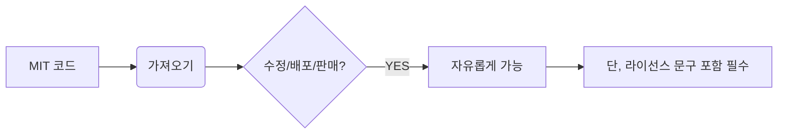

# MIT 라이센스

> "가져가서 마음대로 쓰세요, 하지만 책임은 본인이 지세요."

매사추세츠 공과대학교(MIT)에서 소프트웨어 학생들을 위해 개발한 **[[오픈소스]]** 라이선스다. 가장 공격적이지 않고 관대한(Permissive) 라이선스 중 하나로, 현대 소프트웨어 생태계에서 사실상의 표준처럼 사용된다.

## 주요 특징

- **극도의 자유**: 상업적 이용, 복제, 수정, 배포가 모두 자유롭다.
- **간결함**: 계약서 내용이 매우 짧고 명확하여 이해하기 쉽다.
- **책임 면제**: 소프트웨어 사용으로 인해 발생하는 어떠한 문제에 대해서도 저작권자는 책임을 지지 않는다.

## 지켜야 할 것 (Requirements)

MIT 라이선스 아래의 코드를 사용할 때 지켜야 할 규칙은 딱 하나다.

1. **저작권 고지 및 라이선스 표시**: 원본 소프트웨어의 저작권 문구와 MIT 라이선스 본문을 소프트웨어의 복사본이나 중요한 부분에 반드시 포함해야 한다.

## 왜 많이 쓰이나?

현대의 많은 라이브러리([[React]], [[Vue]], [[Node.js]] 등)가 MIT 라이선스를 채택하고 있다. 이는 기업들이 법적 분쟁 리스크 없이 자유롭게 코드를 가져다 쓰고, 그 위에 자신들의 비즈니스를 쌓아 올릴 수 있도록 장려하기 때문이다.

## 다른 라이선스와 비교

- **[[Apache]] 라이선스**: MIT와 비슷하게 자유롭지만, 특허 관련 조항이 더 명확하게 명시되어 있다.
- **[[GPL]] 라이선스**: MIT와 달리 강한 전염성이 있어, 코드를 사용하면 해당 소프트웨어의 전체 소스 코드를 공개해야 할 의무가 생긴다.

## 요약

